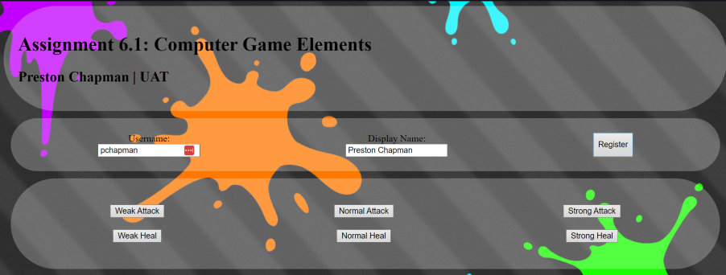
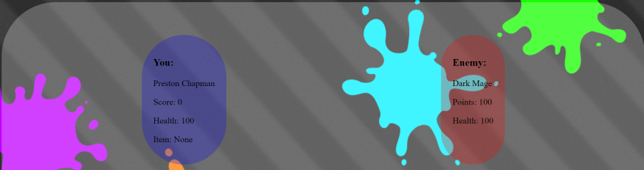
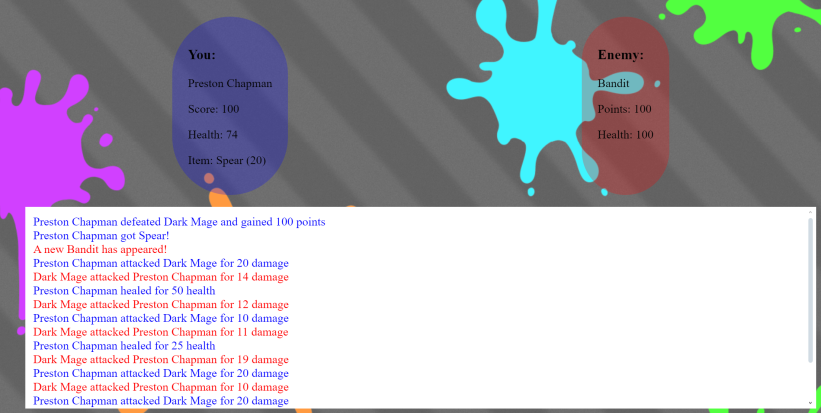

# CSC256 6.1

## About
For this assignment we will be designing a form that will contain elements of a computer game.
You will create a new webpage that will ask the user to enter the appropriate information before they can begin the game.
The X entries typed into separate text fields will be the player's "username", the players "point total", "Health/Damage" and the "weapons" they want to use in the game.
These entries will be captured by your JavaScript form.
Create a "submit" button that once clicked, will output the 4 items to a separate text field/output area on the same page.

## Demo
You can also view the website here https://pchapman-uat.github.io/CSC256-6.1/

 
